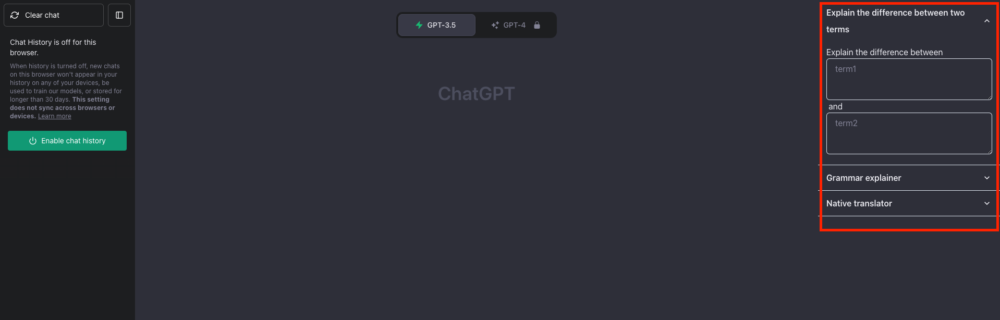

# Chatgpt Template

This is a browser extension that can help you save some commonly used templates of yours to ask chat gpt. So you can easily populate the template the next time when you want to ask a question in the same form.

## How to use it

### Download and install

Clone the project. Run `pnpm install && pnpm build`. And you will see a `dist` folder.

Enable the developer mode in your browser extension management. And select the `dist` folder as the unpackaged extension.

### Create your own templates

Create a github repo, and create a JS file in the repo. The file should only contain template literals as constant variables. The variable names should be in camel case, and they will be your templates' titles. The literal template contents are the contents of the template. Each variable of template literals will be displayed as a field in the extension. Here's my template for you to refer. https://github.com/drafting-dreams/llm-templates/blob/main/index.js

### Setup

Go to the options page of the extension, you need to input `{owner}/{repo}/{path}` of the template file in a github repo. Still using the above example, the github information that you should fill in the input will be `drafting-dreams/llm-templates/index.js`.

After filling in the correct github information, click the extension icon, and click "Update templates".

### Use your templates

After setting it up, you will be able to see your templates once you open the chatgpt window.

As you can see the variable name in your placeholder has become the placeholder for the corresponding field. If you don't intput anything, the template will use the placeholder to ask a question.

To send a question, focus on any input and press (alt/option + Enter).

If you turn off the chat history of your chatgpt. Each time you send a question, it will clear your chat history first. If chat history is on, it will not clear your history.
